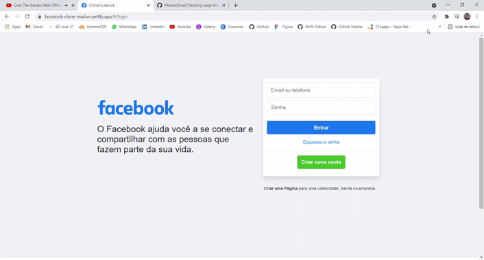

<h1 align="center">
    <br>
    Clone Facebook
</h1>

<h4 align="center">
Prjeto desenvolvido com propósitos estudantis
</h4>

<p align="center">
  

  

  <a href="https://www.codacy.com/app/marlonsilva21/clone-facebook?utm_source=github.com&amp;utm_medium=referral&amp;utm_content=marlonsilva21/clone-facebook&amp;utm_campaign=Badge_Grade">
    
  </a>

  
  <a href="https://github.com/marlonsilva21/clone-facebook/commits/master">
    
  </a>

  <a href="https://github.com/marlonsilva21/rest-api-nodejs/issues">
    
  </a>

  
</p>



<p align="center">
  <a href="#rocket-technologies">Tecnologias </a>&nbsp;&nbsp;&nbsp;&nbsp;&nbsp;&nbsp;
  <a href="#install">Como instalar </a>&nbsp;&nbsp;&nbsp;&nbsp;&nbsp;&nbsp;
  <a href="#features">Recursos e Funcionalidades </a>&nbsp;&nbsp;&nbsp;&nbsp;&nbsp;&nbsp;
  <a href="#structure">Estrutura do projeto </a>&nbsp;&nbsp;&nbsp;&nbsp;&nbsp;&nbsp;
</p>

## :rocket: Tecnologias

<p id="rocket-technologies">Este projeto foi desenvolvido com as principais tecnologias:</p>

- [Angular](https://angular.io/)
- [TypeScript](https://www.typescriptlang.org/)
- [Bootstrap](https://getbootstrap.com/)
- [HTML5](https://www.devmedia.com.br/o-que-e-o-html5/25820)
- [CSS3](https://www.w3schools.com/css/)

<h2 id="install"> Como instalar </h2>

### Using Git (recommendado)

1.  Clone o projeto do github. 

```bash
git clone https://github.com/MarlonSilva21/clone-facebook.git 
```

### Usando o zip do Download manual

1.  Faça download do repositório
2.  Descompacte para o diretório desejado

### Instale as dependências do npm após a instalação (Git ou download manual)

```bash
npm install
```
<h2 id="features"> Recursos </h2>

- Autenticação básica (registrar / fazer login com senha em hash)
- Tokens JWT, faça solicitações com um token após o login com o cabeçalho `Authorization` com o valor `seuToken` onde o `seuToken` será retornado na resposta de Login.
- Estruturas de resposta predefinidas com códigos de status adequados.
- Validações adicionadas.

<h2> Funcionalidades </h2> 

- Puxando as postagens e usuários dinamicamente do banco de dados
- Ordenando as postagens exibindo a última que foi postada primeiro
- Filtro de usuários 
- Tela de perfil para poder ver as suas postagens ou entrar no perfil de outro usuário
- Poder fazer suas postagens direto da plataforma

<h2 id="structure"> Project structure </h2>

```sh
.
├── package.json
├── package-lock.json
├── angular.json
├── tsconfig.json
└── src
    ├── app
    │   ├── alerts
    │   │   ├── alerts.component.css
    │   │   ├── alerts.component.html
    │   │   └── alerts.component.ts
    │   │
    │   ├── home
    │   │   ├── home.component.css
    │   │   ├── home.component.html
    │   │   └── home.component.ts
    │   │
    │   ├── login
    │   │   ├── login.component.css
    │   │   ├── login.component.html
    │   │   └── login.component.ts
    │   │
    │   ├── models
    │   │   ├── Postagem.ts
    │   │   ├── Usuario.ts
    │   │   └── UsuarioLogin.ts
    │   │
    │   ├── perfil-usuario
    │   │   ├── perfil-usuario.css
    │   │   ├── perfil-usuario.html
    │   │   └── perfil-usuario.ts
    │   │
    │   ├── services
    │   │   ├── alert.service.ts
    │   │   ├── auth.service.ts
    │   │   └── postagem.service.ts
    │   │
    │   │
    │   ├── app-routing.module.ts
    │   ├── app.component.css
    │   ├── app.component.html
    │   ├── app.component.ts
    │   └── app.module.ts
    │   
    ├── assets
    ├── environments
    │   ├── environment.prod.ts
    │   └── environment.ts
    │
    ├── favicon.ico
    ├── index.html
    ├── main.ts
    └── styles.css
    

```

### Para rodar localmente:

```bash
ng serve 
```

This project was generated with [Angular CLI](https://github.com/angular/angular-cli) version 12.2.10.

##

Made with ♥ by Marlon Silva :wave: [Get in touch!](https://www.linkedin.com/in/marlon-silva-43075a184/)


